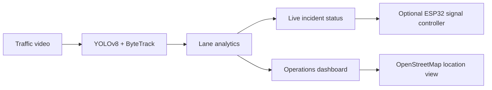

# UrbanGrid AI

> **Real-time traffic intelligence for safer, faster intersections.**

UrbanGrid AI is a computer-vision traffic operations platform. It analyzes a
live video feed, detects and tracks vehicles, measures lane occupancy, flags
congestion, and presents the result in a real-time operations dashboard.

## What It Does

| Capability | Status |
| --- | --- |
| YOLOv8 vehicle detection | Operational |
| ByteTrack tracking with detection fallback | Operational |
| Lane-wise occupancy and congestion scoring | Operational |
| Live incident analysis | Operational |
| Original-speed MJPEG camera feed | Operational |
| OpenStreetMap location monitoring | Operational |
| ESP32 HTTP signal control | Optional |
| Traffic forecasting and adaptive timing | In development |

## System Flow



## Tech Stack

* **Vision:** YOLOv8, OpenCV, ByteTrack
* **Backend:** Python, Flask
* **Dashboard:** HTML, CSS, JavaScript, Chart.js, Leaflet
* **Mapping:** OpenStreetMap tiles
* **Hardware:** ESP32 HTTP signal controller
* **Planned integrations:** PyTorch forecasting, React, PostgreSQL, SUMO

## Current Release

The dashboard pipeline is operational for local development. Green bounding
boxes identify detected vehicles, while the map marker shows current traffic
state: green for low, yellow for medium, and red for high or critical traffic.

## Quick Start

From the project root, start the dashboard with the project environment:

```powershell
.\venv311\Scripts\python.exe -m dashboard.app
```

Then open [http://localhost:5000](http://localhost:5000).

The application expects the sample video at `data/raw/traffic.mp4` and the
bundled `yolov8n.pt` model. The smaller model is the default for reliable CPU
inference.

## Map Configuration

The map defaults to Delhi coordinates. Set a different intersection before
starting the server:

```powershell
$env:UG_MAP_LAT="28.6139"
$env:UG_MAP_LON="77.2090"
$env:UG_MAP_NAME="My Traffic Junction"
```

The map uses OpenStreetMap tiles, so an internet connection is required for
the map background.

## ESP32 Signal Control

The ESP32 firmware must expose `/red`, `/yellow`, and `/green` HTTP handlers and
be reachable from the same network as the computer running Python.

Set its address before starting the controller:

```powershell
$env:ESP32_IP="192.168.1.120"
python urbangrid/esp32_controller.py
```

Wokwi's `10.10.0.2` address is an isolated simulator address and is not
normally reachable directly from the host computer.

## Repository Layout

```text
dashboard/       Flask application and operations UI
urbangrid/       Detection, lane, signal, and ESP32 modules
config/          Lane calibration data
data/            Raw video and processed traffic data
models/          Trained forecasting model outputs
notebooks/       Analysis and experimentation scripts
tests/           Automated tests
```
